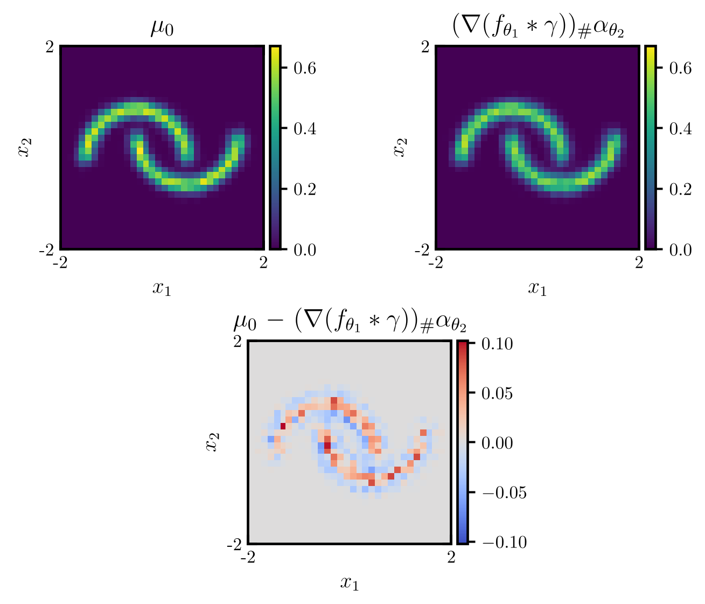
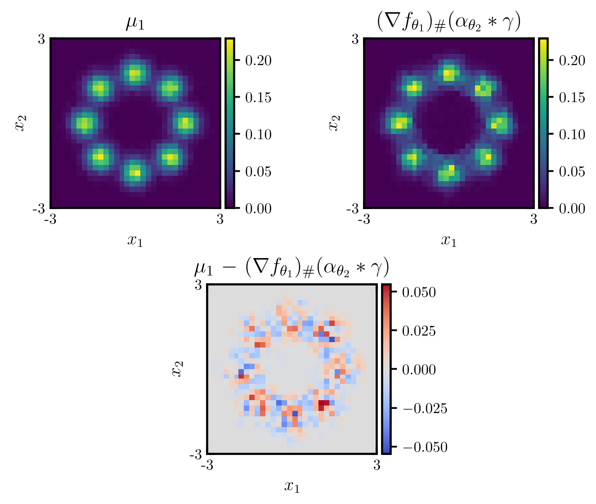

# The Martingale Sinkhorn Algorithm (martingale-sinkhorn)

This package contains the code used in the paper

> **The Martingale Sinkhorn Algorithm**  
> Manuel Hasenbichler, Benjamin Joseph, Gregoire Loeper, Jan Obloj, Gudmund Pammer  
> arXiv:2310.13797, https://doi.org/10.48550/arXiv.2310.13797

`martingale-sinkhorn` implements an expectile-based neural version of the Martingale Sinkhorn scheme that solves the Martingale Benamou–Brenier problem.  
It is written in JAX and uses **OTT-JAX** for the optimal transport components.

<p align="center">
  
  
</p>
<p align="center">
  <em>The Bass martingale from two moons (centred) to eight Gaussians. 
  The source (left) and target (right) panels show the true distribution, 
  the fitted distribution, and their difference.</em>
</p>

For the precise problem formulation, assumptions and proofs, please refer to the paper. The goal of this repository is to provide the code and examples used there.

---

## Installation

Requires Python 3.10+ and a working JAX installation (CPU or GPU).

From the repository root (where `pyproject.toml` is located):

```bash
# optional: create a virtual environment
python -m venv .venv
source .venv/bin/activate      # on Windows: .venv\Scripts\activate

# install the library
pip install -e .
```

For plotting and animations, install the `viz` extra:

```bash
pip install -e '.[viz]'
```

This adds `matplotlib`.

---

## Layout

```text
msinkhorn/
├── pyproject.toml
├── README.md
├── assets/
│   └── readme/
├── src/
│   └── msinkhorn/
│       ├── __init__.py
│       ├── solver.py
│       ├── _utils.py
│       └── viz2d.py
└── examples/
    ├── gaussian_mixture_refinement.py
    ├── moons_to_8_gaussians.py
    ├── uniform_disk_to_uniform_circle.py
    ├── *.ckpt       # checkpoints
    ├── *.pdf        # figures
    └── *.mp4        # animations
```

### `src/msinkhorn`

- `solver.py`  
  - `ExpectileNeuralMOT`: expectile-regularised neural Martingale Optimal Transport solver.  
  - `NMOTPotentials`: wrapper around the learned potentials, with helpers for pushing samples and simulating the Bass martingale.

- `_utils.py`  
  - `DataSampler`: simple mini-batch sampler for JAX arrays.  
  - `LossTracker`: moving averages of training and validation losses.

- `viz2d.py`  
  - `plot_mtransport_validation_2d`: 2D plots of source, target and Bass measures.  
  - `animate_bass_martingale`: MP4 animations of martingale paths (requires `matplotlib`).

### `examples/`

The examples correspond to the numerical experiments in the paper and reproduce the figures and animations (up to sampling variability):

- `uniform_disk_to_uniform_circle.py`
- `moons_to_8_gaussians.py`
- `gaussian_mixture_refinement.py`

Each example comes with:

- a checkpoint (`*.ckpt`) with trained parameters,
- PDFs with the figures,
- MP4 animations (`*_planar.mp4`, `*_3d.mp4`).

---

## Minimal usage example

```python
import jax
import jax.numpy as jnp
from ott.neural.networks import potentials
import optax

from msinkhorn import ExpectileNeuralMOT


key = jax.random.PRNGKey(0)

key, k0, k1, ksolve = jax.random.split(key, 4)

n0 = n1 = 20000
dim = 2
mu0 = jax.random.normal(k0, (n0, dim))
mu1 = jax.random.normal(k1, (n1, dim)) + jnp.array([2.0, 0.0])

def make_mlp():
    return potentials.MLP(
        dim_hidden=[64, 64, 64, 1],
        act_fn=jax.nn.silu,
    )

solver = ExpectileNeuralMOT(
    dim_data=dim,
    neural_f=make_mlp(),
    neural_g=make_mlp(),
    neural_h=make_mlp(),
    optimizer_f=optax.adam(5e-4),
    optimizer_g=optax.adam(5e-4),
    optimizer_h=optax.adam(5e-4),
    expectile=0.98,
    expectile_loss_coef=0.5,
    key=ksolve,
    nsim=256,
)

res = solver(
    num_train_iters=5,
    batch_size=1024,
    num_iters_per_step={"ENOT": 4000, "gen": 200},
    train=(mu0, mu1),
)

# res is an NMOTPotentials instance
key, ksim = jax.random.split(key)
M_jax = result.sim_bass_martingale(
    x=mu0[:512],
    nsteps=64,
    ncond=512,
    key=ksim,
    batch_size=64,  # adjust based on memory constraints
)
```

For more complete examples, including how figures and animations are generated, see the scripts in `examples/`.

---

## Based on OTT-JAX

The implementation relies on **OTT-JAX** for optimal transport solvers and neural potentials:

> **Optimal Transport Tools (OTT): A JAX Toolbox for all things Wasserstein**  
> Marco Cuturi, Laetitia Meng-Papaxanthos, Yingtao Tian, Charlotte Bunne, Geoff Davis, Olivier Teboul  
> arXiv:2201.12324

---

## Authors

The method and experiments are joint work:

- Manuel Hasenbichler  
- Benjamin Joseph  
- Gregoire Loeper  
- Jan Obloj  
- Gudmund Pammer

The code in this repository is maintained by Manuel Hasenbichler.

---

## Citation

If you use this package in your work, we kindly ask that you cite:

```bibtex
@article{hasenbichler2025martingalesinkhornalgorithm,
  title   = {The Martingale Sinkhorn Algorithm}, 
  author  = {Hasenbichler, Manuel and Joseph, Benjamin and Loeper, Gregoire and Obloj, Jan and Pammer, Gudmund},
  journal = {arXiv preprint arXiv:2310.13797}, 
  year    = {2025},
}
```

and

```bibtex
@article{cuturi2022ott_jax,
  title   = {Optimal Transport Tools (OTT): A JAX Toolbox for all things Wasserstein},
  author  = {Cuturi, Marco and Meng-Papaxanthos, Laetitia and Tian, Yingtao and Bunne, Charlotte and Davis, Geoff and Teboul, Olivier},
  journal = {arXiv preprint arXiv:2201.12324},
  year    = {2022}
}
```